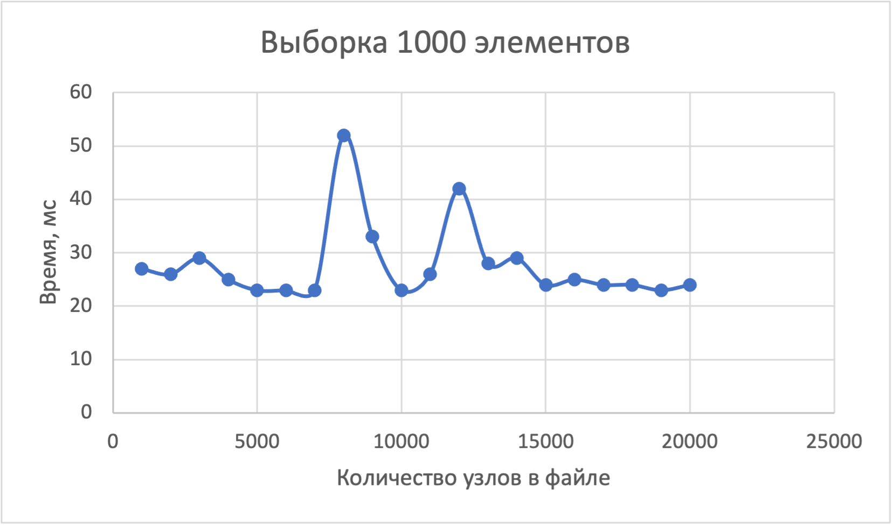
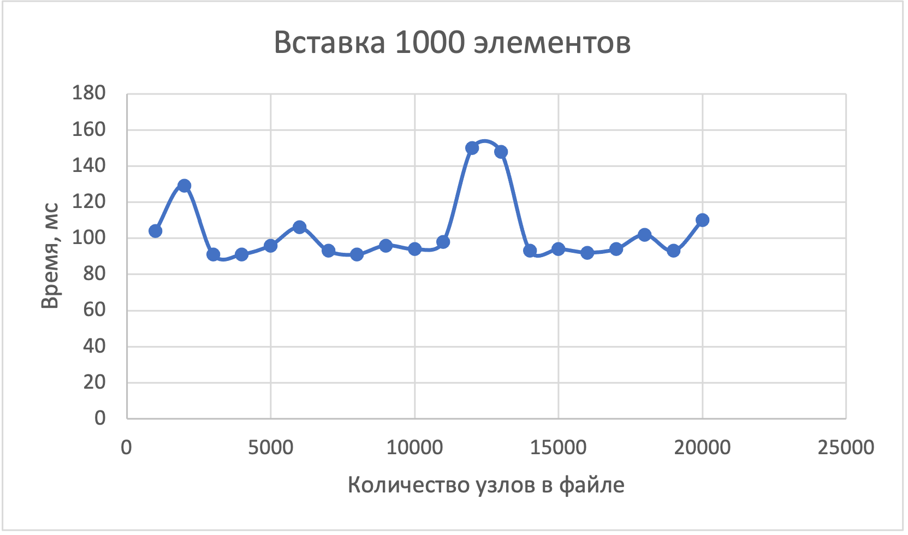
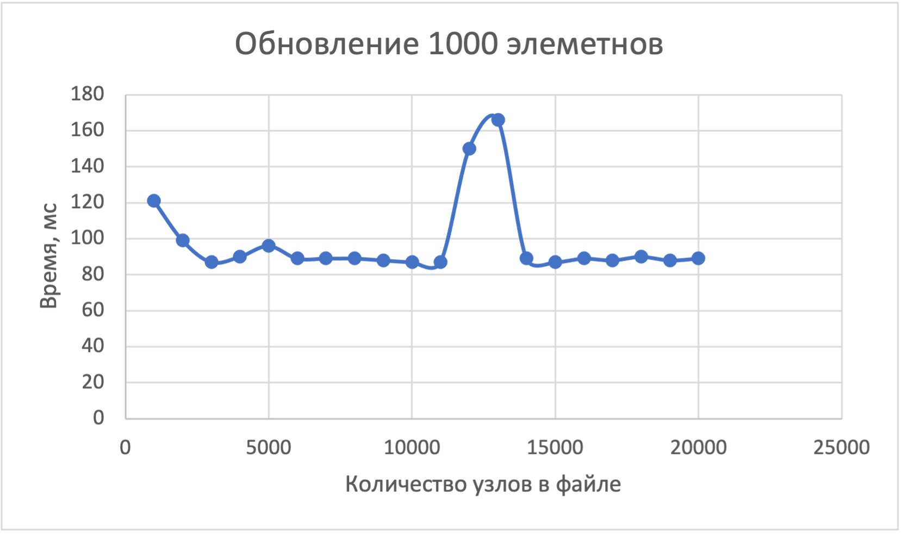
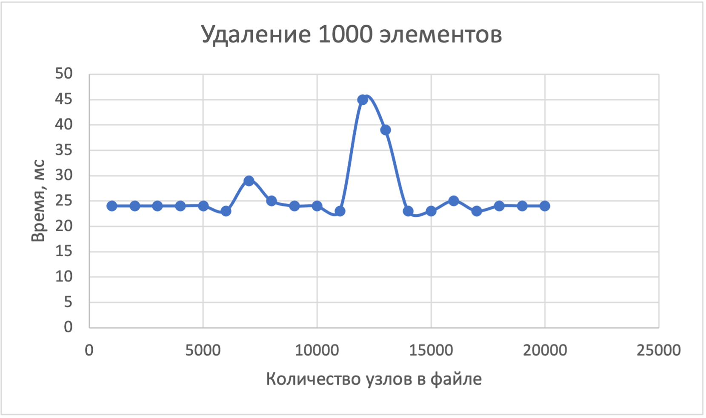

# Низкоуровневое программирование
## Лабораторная работа №1

Вариант 1: Документное дерево

### Установка

#### Зависимости

* Clang
* CMake 3.23 и выше

#### Запуск

`*nix`: `bash nix.sh`

`windows`: 

mkdir build

cd build

cmake .. -D CMAKE_C_COMPILER="C:\Program Files\LLVM\bin\clang.exe" -D CMAKE_CXX_COMPILER="C:\Program Files\LLVM\bin\clang++.exe"

cmake --build . --target ALL_BUILD --config Release


### Цели

Создать модуль, реализующий хранение в одном файле данных (выборку, размещение и гранулярное
обновление) информации общим объёмом от 10GB соответствующего варианту вида.

### Задачи

* Спроектировать структуры данных для представления информации в оперативной памяти
    - Для порции данных. Поддержать тривиальные значения по меньшей мере следующих типов: цетырёхбайтовые целые числа и числа с плавающей точкой, текстовые строки произвольной длины, булевские значения
    - Для информации о запросе
* Спроектировать представление данных с учетом схемы для файла данных и реализовать базовые операции для работы с ним:
    - Операции над схемой данных (создание и удаление колонок)
    - Базовые операции над элементами данных в соответствии с текущим состоянием схемы (над записями заданного вида)
        1. Вставка элемента данных
        2. Перечисление элементов данных
        3. Обновление элемента данных
        4. Удаление элемента данных
* Используя в сигнатурах только структуры данных из п.1, реализовать публичный интерфейс со следующими операциями над файлом данных:
    - Добавление, удаление и получение информации о элементах схемы данных, размещаемых в файле данных, на уровне, соответствующем виду записей
    - Добавление нового элемента данных определённого вида
    - Выборка набора элементов данных с учётом заданных условий и отношений со смежными элементами данных (по свойствам/полями/атрибутам и логическим связям соответственно)
    - Обновление элементов данных, соответствующих заданным условиям
    - Удаление элементов данных, соответствующих заданным условиям
* Реализовать тестовую программу для демонстрации работоспособности решения

### Описание работы

#### Структуры

* `node` - узел дерева

```c++
struct node {
    int32_t id{}; //позиция в файле
    std::string name; //имя узла
    std::unordered_map<std::string, attr> attrs; //список аттрибутов
};
```

* `attr` - атрибут конкретного узла 
```c++
struct attr {
    enum type {INT, BOOL, FLOAT, STRING}; //тип

    type tag;
    int32_t int_val;
    bool bool_val{};
    float float_val{};
    std::string string_val;
};
```

* `meta` - метаинформация

```c++
struct meta {
    int32_t count = 0; //количество узлов
    std::unordered_map<int32_t, std::unordered_set<int32_t>> children; //отношения между узлами
    std::unordered_map<std::string, int32_t> position; //узнать по заданному пути позицию в файле
    std::unordered_map<int32_t, std::string> path; //узнать по позиции в файле путь
    std::vector<int32_t> free; //список узлов, которые можно перезаписать
};
```

### Аспекты реализации

* Первые 256 Мб в файле отведены под хранение мета информации
* Размер метаинформации рассчитан на хранение 10Гб или 3кк узлов из соотношения 60 узлов = 4Кб мета информации
* Каждый узел занимает ровно 4Кб
* Доступ к конкретному узлу осуществляется за O(1) т.к. благодаря unoredered_map в метаинформации
* Удаляя элемент мы удаляем только метаинформацию о нем и помечаем как удаленный. В последствии память под этот элемент будет перезаписана другим элементом.
* Сериализация / десериализация происходит с помощью библиотеки `cereal`

### Результаты









Все операции выполняются за O(1) благодаря использованию хеш мап

### Выводы 

В результате выполнения лабораторной работы был разработан модуль, реализующий хранение в одном файле данных в виде документного дерева, объем данных может достигать 10GB, при этом не снижая произоводительности. Модуль поддерживает операции select, insert, update, delete.
Модуль может работать под управлением ОС семейств Windows и *NIX.
